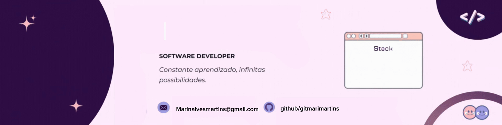

  

#

Estudante de Engenharia de Computação na Universidade Federal de Mato Grosso

#

<h3 align="left">Contato:</h3>

  </a>
  

<h3 align="left">My Stack:</h3>

  
  
  
  
  
  
  
  

#

  <h3> GitHub Stats </h3>
   
  
  

#

<picture align="center">
  <source media="(prefers-color-scheme: dark)" srcset="https://raw.githubusercontent.com/gitmarimartins/gitmarimartins/output/github-contribution-grid-snake-dark.svg">
  <source media="(prefers-color-scheme: light)" srcset="https://raw.githubusercontent.com/gitmarimartins/gitmarimartins/output/github-contribution-grid-snake-dark.svg">
  
</picture>
